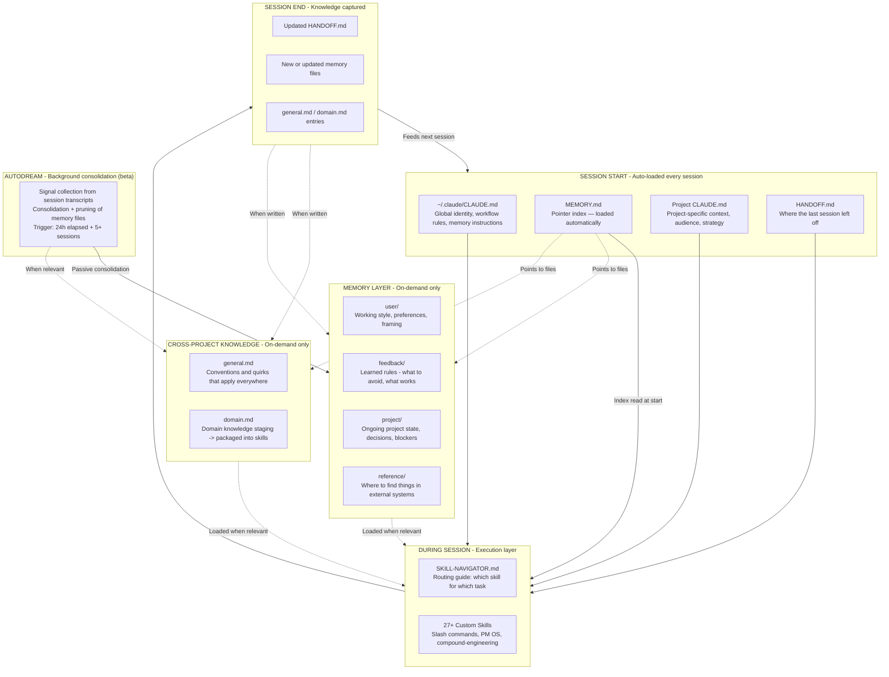

# Claude Code Infrastructure — Status Snapshot V1.1

Date: 2026-03-26
Previous: infrastructure-status.md (V1, 2026-03-25)

---

## What this document is

A point-in-time audit of my global Claude Code infrastructure.
V1.1 = one day of deliberate maintenance after V1. AutoDream enabled during this period.
Use this as the updated baseline to measure V2 against.

---

## Architecture Overview

How the layers connect and feed each other:

---

## Component Inventory

| Component | Location | Status | Notes |
|---|---|---|---|
| Global CLAUDE.md | `~/.claude/CLAUDE.md` | Active, solid | Role context, workflow rules, memory instructions present |
| MEMORY.md index | `~/.claude/memory/MEMORY.md` | Active | 7 entries across 4 types — hand-maintained pointer index |
| general.md | `~/.claude/memory/general.md` | **Active** *(was empty in V1)* | 4 entries: CLAUDE.md hygiene, auto-load cost, macOS quirk, GitHub push pattern |
| domain.md | `~/.claude/memory/domain.md` | Active | 4 entries — skill authoring, web dev workflow, git worktrees, CV positioning |
| user memories | `~/.claude/memory/user_*.md` | Thin — 1 entry | Only conductor preferences captured at global level |
| feedback memories | `~/.claude/memory/feedback_*.md` | Improving | Global: 1 entry. Home namespace: ~6 entries |
| project memories | `~/.claude/memory/project_*.md` | 1 entry (PMOS audit, completed) | Historical event, prune candidate on next AutoDream run |
| reference memories | `~/.claude/memory/reference_*.md` | 3 entries | Conductor V2 (active), infrastructure audit format (active) |
| SKILL-NAVIGATOR.md | `~/.claude/SKILL-NAVIGATOR.md` | Active, well-maintained | 8-phase routing guide, overlap distinctions, audited |
| Custom skills | `~/.claude/skills/user/` | 27+ skills, audited | Gotchas sections added (seeds only — grow from real failures) |
| HANDOFF.md | Per-project | Active in some projects | Used in LinkedIn Strategy, Conductor V2 — not universal |
| Project CLAUDE.md | Per-project | Active in some projects | LinkedIn Strategy is good — not all projects have one |
| AutoDream | `~/.claude/settings.json` | **Enabled** *(new in V1.1)* | `autoDreamEnabled: true`. Has run on LinkedIn project. Not yet on global memory. |

---

## Health Assessment

| Layer | V1 | V1.1 | Delta | Notes |
|---|---|---|---|---|
| Architecture design | 100% | 100% | — | Unchanged |
| Global CLAUDE.md | 80% | 80% | — | Unchanged |
| Skills system | 80% | 80% | — | Skill gotchas still mostly empty seeds |
| Memory system (design) | 80% | 80% | — | Unchanged |
| Memory system (utilization) | 40% | 60% | +20% | general.md populated; home namespace rich |
| Cross-project knowledge | 20% | 30% | +10% | general.md now has real content |
| Feedback capture | 20% | 40% | +20% | Home namespace substantially better; global still thin |
| Session continuity (HANDOFF) | 60% | 60% | — | No change |
| **Overall** | **55%** | **66%** | **+11%** | One day of deliberate maintenance |

**What moved the needle:** `general.md` populated (was empty); Session 2 confirmed done via git log (rename, .gitignore, memory sync committed); home namespace feedback grew to ~6 entries. Cross-project knowledge and session continuity unchanged.

---

## AutoDream

AutoDream (beta, not officially announced) consolidates and reorganises Claude Code memory. 4 phases: Orientation → Signal Collection → Consolidation → Pruning & Indexing. Processes session transcripts, extracts patterns, resolves contradictions, updates indexes.

**Current status:**
- Enabled: `autoDreamEnabled: true` in `~/.claude/settings.json`
- Has run: LinkedIn Strategy project (2026-03-25 ~20:22)
- Has NOT run yet: Global `~/.claude/memory/` — no lock file found
- Trigger: 24h since last consolidation + 5+ sessions

**Compatibility:**

| Your structure | AutoDream fit | Notes |
|---|---|---|
| Typed frontmatter (user/feedback/project/reference) | ✅ Excellent | AutoDream uses metadata for intelligent pruning decisions |
| One file per topic | ✅ Excellent | Can operate on entries individually without side effects |
| MEMORY.md as pointer index | ⚠️ Risk | Index is hand-maintained — AutoDream may prune a file without removing its pointer, breaking session load |
| Global memory layer | ⚠️ Not yet run | First run will process 7 entries. `project_pmos_audit.md` is a prune candidate |

**What it fixes:** passive feedback capture from transcripts; continued general.md population without end-of-session discipline; stale entry pruning.

**What it doesn't fix:** cross-project knowledge (operates per-project only); MEMORY.md index integrity (hand-maintained, not a memory file); mid-session proactivity (Session 3 — complementary problem).

---

## Known Gaps (V1.1 → V2 targets)

1. **MEMORY.md index integrity** — highest risk with AutoDream enabled. Add explicit protection note to `~/.claude/CLAUDE.md`.
2. **Cross-project knowledge** — no linking mechanism. `general.md` partially fills this but AutoDream doesn't aggregate across projects.
3. **Feedback capture (global)** — 1 entry at global level. AutoDream will backfill from transcripts on first run.
4. **Session continuity** — HANDOFF.md not universal. Still project-by-project.
5. **Session 3 (auto-memory proactivity)** — narrowed problem now (passive capture covered by AutoDream). Remaining gap: mid-session feedback writing.
6. **Skill gotchas** — empty seeds in most skills. Grow from real failures, not pre-filled.

---

## What V2 looks like

- `general.md`: 8+ entries (AutoDream will grow this passively)
- Feedback: 6–8 global entries (AutoDream backfills from transcripts)
- MEMORY.md integrity: protected via explicit instruction in CLAUDE.md
- Cross-project knowledge: still the one architectural gap AutoDream doesn't touch
- Session 3: redefined as mid-session proactivity only

**Target overall: 75–80%** — achievable without manual work once AutoDream runs on global memory.

---

*Supersedes: infrastructure-status.md (V1, 2026-03-25). Next review: after AutoDream first runs on global memory.*
